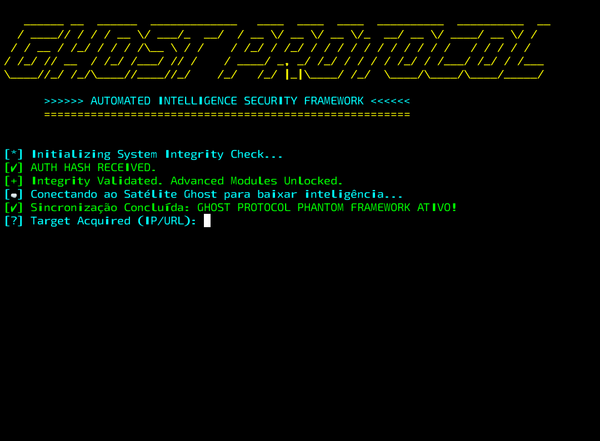

  
    
     
  *Execução controlada em ambiente mobile tático (Termux + Kali Linux)*  

# 🛡️ GHOST PROTOCOL — PHANTOM FRAMEWORK
### Power Hat Offensive Security Architecture

⚠️ **USO, CONTEXTO E POSICIONAMENTO**
Este repositório apresenta o **GHOST PROTOCOL — PHANTOM FRAMEWORK**, um ecossistema proprietário de segurança ofensiva de alta precisão. Ele não é um "scanner" no sentido tradicional; é uma arquitetura de decisão projetada para ambientes onde a detecção não é uma opção.

* **Não é uma ferramenta recreativa:** Não há interface simplificada para usuários casuais.
* **Não é um produto de prateleira:** Cada instância é adaptada à necessidade estratégica.
* **Foco em Invisibilidade:** Projetado para operar sob o radar de EDRs e WAFs modernos.

---

🎯 **O QUE É O GHOST PROTOCOL**
O Ghost Protocol é um framework orientado a **Inteligência Adaptativa**. Enquanto ferramentas comuns disparam payloads de forma linear, o Ghost opera através de um ciclo de vida não-linear:

1.  **Passive Stealth Recon:** Coleta de sinais sem interação direta.
2.  **Fingerprinting Comportamental:** Identificação de defesas baseada na resposta de latência e desvio de pacotes.
3.  **Contextual Decision:** O framework escolhe a arma baseada no terreno, não no inventário.

> "A execução é a última etapa de um processo longo de inteligência. No Ghost, o silêncio é o estado padrão."

---

🧠 **FILOSOFIA POWER HAT: ALÉM DO BEM E DO MAL**
O Ghost opera sob a doutrina **Power Hat**. Não nos limitamos às definições burocráticas de mercado. 

* **Pragmatismo Radical:** Se uma vulnerabilidade existe, ela será mapeada. Sem eufemismos.
* **Neutralidade Operacional:** Não seguimos agendas políticas ou corporativas. Nossa única lealdade é à integridade técnica e ao objetivo do contrato.
* **Remoção de Máscaras:** Expomos a fragilidade de sistemas que se dizem "impenetráveis" através de dados brutos e execução cirúrgica.

---

🧩 **PILARES TÉCNICOS (ABSTRAÇÃO ESTRUTURAL)**

#### 🛡️ Low Noise, High Impact (LNHI)
Minimizamos a pegada digital através de técnicas de fragmentação de requisições e rotação inteligente de assinaturas. O objetivo é nunca atingir os thresholds de alerta dos centros de operações de segurança (SOC).

#### 🧬 Adaptive Payload Transformation
Nossa tecnologia de transformação garante que payloads conhecidos sejam reescritos em tempo real, alterando entropia e estrutura para evadir detecção estática e análise heurística.

#### 📡 Decision Logic Engine
O "cérebro" do Phantom Framework. Um motor de lógica que correlaciona falhas lógicas, permissões mal configuradas e vulnerabilidades de dia zero para criar cadeias de ataque (Attack Chains) complexas.

---

🔒 **OPSEC & PROPRIEDADE INTELECTUAL**
A segurança deste framework é tratada com o mesmo rigor que as operações que ele executa.
* **Privacidade do Core:** A lógica de decisão e os algoritmos de bypass residem em camadas criptografadas não expostas.
* **Resiliência Conceitual:** O Ghost foi desenhado para ser resiliente a tentativas de engenharia reversa por análise de tráfego.

*Qualquer tentativa de clonagem ou uso de terminologia proprietária sem autorização será tratada como violação de propriedade intelectual.*

---

🏢 **DESTINAÇÃO E CONTRATAÇÃO**
O Ghost Protocol não está disponível para o público geral. Ele é destinado exclusivamente a:
* **Operações de Red Team Tier-1**
* **Governos e Entidades Estratégicas**
* **Auditorias de Infraestrutura Crítica**

---

📜 **LICENÇA & STATUS**
© **Ghost Security Systems**
**Status:** Operacional / Desenvolvimento Contínuo.
**Acesso:** Restrito | Sob Contrato de Confidencialidade (NDA).
**Origem:** Projeto anti-analfabetismo digital e defesa avançada.

---
