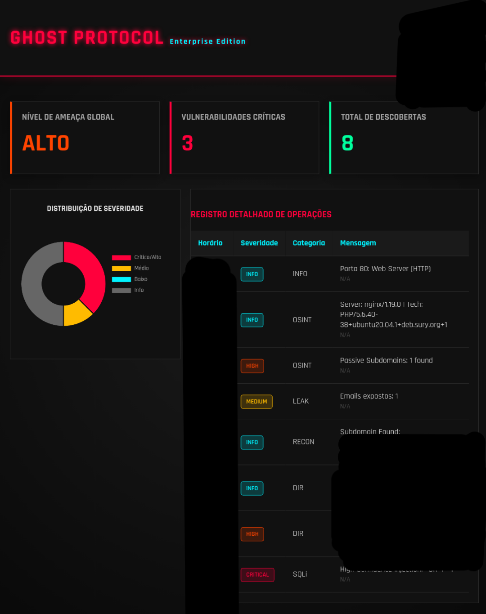

#  GHOST - AUTONOMOUS ADVERSARY EMULATION ENGINE - COGNITIVE C2 FRAMEWORK 🛰️

O **GHOST** é uma infraestrutura de Comando e Controle (C2) de última geração, projetada para testes de resiliência corporativa (Red Teaming) e conscientização de segurança. O framework simula as táticas, técnicas e procedimentos (TTPs) de Ameaças Avançadas Persistentes (APTs), operando como um motor focado em inteligência ofensiva e emulação de adversários.

## 🏴‍☠️ Manifesto Operacional: A Doutrina Power Hat

> "Esqueça a 'ética' de vitrine. A doutrina Power Hat repudia a censura e qualquer limite ao acesso à informação. É a capacidade nua e crua de operar em um cenário de ataque total, utilizando qualquer meio disponível. Meu combate é contra o analfabetismo digital. Se a sua empresa quer sobreviver no mundo real, você precisa de uma auditoria feita por quem sabe bater sem amarras mercadológicas."
> 
> — **Ghost Cruz**

---

  
    
  
  
  

---

> **Proposta de Valor:** O GHOST é uma plataforma de segurança cibernética orientada a risco, projetada para validar a integridade de infraestruturas críticas sob condições de estresse real.

---

## 🏗️ Arquitetura e Topologia

O GHOST opera através de uma central de comando descentralizada, focada em furtividade, coleta passiva de telemetria e manutenção de acesso. Toda a arquitetura foi desenhada para operar silenciosamente, extraindo informações vitais sem alertar os sistemas de defesa.

### 1. Comunicação Resiliente e Mascaramento
- **Roteamento Dinâmico:** Utilização de redes overlay criptografadas para mascarar a identidade e a localização exata do servidor de comando, impedindo o rastreio da origem da auditoria.
- **Canal de Comando Blindado:** Protocolos de autenticação estritos para garantir que apenas agentes autorizados consigam se comunicar com a central de inteligência.

### 2. Telemetria e Controle Contínuo
- **Gestão de Sessões Assíncronas:** Capacidade de orquestrar múltiplos endpoints de forma simultânea, garantindo o recebimento de dados (beaconing) e o envio de comandos táticos sem interrupções.
- **Monitoramento Operacional:** Sistema de heartbeat passivo que acompanha a saúde e o status de cada agente implantado no ambiente auditado.

### 3. Extração e Estruturação de Inteligência (Looting)
- **Catalogação Automatizada:** Módulo central focado na recepção e análise de artefatos extraídos do ambiente alvo. Os dados coletados são automaticamente estruturados em cofres criptografados locais para posterior análise forense.
- **Integração de Enumeração:** Capacidade de interagir de forma contínua com motores de varredura para extrair estruturas de bancos de dados e mapeamento de redes internas.

### 4. Evasão Passiva e Estabilidade Operacional
- **Manutenção de Persistência:** O framework estabiliza conexões e processos mesmo sob rigorosas políticas de gerenciamento de memória corporativa e limitações de background, garantindo a continuidade do engajamento.
- **Heurística de Adaptação:** O agente ajusta seu comportamento e fluxo de rede para se misturar ao tráfego legítimo do ambiente alvo, evitando anomalias que disparem alarmes de segurança.

---

## 🎯 Metodologia e Arquitetura

Nossa abordagem prioriza a integridade do ambiente e a precisão da telemetria. O GHOST foi projetado para ser uma solução silenciosa, focada na extração de inteligência de decisão para gestores e equipes de defesa.

  
   
  <em>Fig 1. Fluxo de Orquestração: Integração de camadas de comando e controle focadas em inteligência ofensiva.</em>

### Camadas de Execução
* **Avaliação (Input):** Utiliza técnicas passivas e ativas para mapear a exposição real da infraestrutura, identificando ativos críticos e sombras digitais (Shadow IT).
* **Orquestração (Processing):** Teste contínuo da eficácia de barreiras defensivas através do estabelecimento de comunicação contínua com a infraestrutura C2.
* **Decisão (Presentation):** Transforma evidências técnicas em artefatos de decisão priorizados para a alta gestão, permitindo o gerenciamento de risco sob demanda.

---

## 🧠 Resiliência Sistêmica

A plataforma adota uma visão holística, mapeando como pequenas fragilidades podem comprometer a resiliência de toda a infraestrutura organizacional.

  
   
  <em>Fig 2. Visão Executiva: Interface desenhada para transformar dados técnicos complexos em níveis de ameaça global e métricas de severidade.</em>

### Topologia de Risco Neural
Para uma análise profunda, o motor mapeia as interconexões de ativos, prevendo caminhos de comprometimento que ferramentas estáticas ignoram.

  
   
  <em>Fig 3. Core Neural: Processamento de correlação para identificar pontos únicos de falha na infraestrutura.</em>

---

## ⚖️ Modelo de Entrega e Operação

**O GHOST é uma Plataforma Gerenciada.**
O acesso à tecnologia é restrito a organizações qualificadas que buscam o mais alto nível de validação de resiliência.

  
   
  <em>Fig 4. Registro de Operações: Detalhamento de validações em tempo real, garantindo rastreabilidade.</em>

### Para quem é esta solução?
* 🏢 **Infraestruturas Críticas:** Energia, Telecomunicações e Logística.
* 🏦 **Setor Financeiro:** Ambientes sob alta regulação e exigência de sigilo.
* 🛡️ **Centros de Operações de Segurança (SOCs):** Para aprimoramento contínuo da capacidade de detecção.

---

## ⚠️ Aviso Legal e Ética

Este projeto é estritamente educacional e focado em pesquisa defensiva/ofensiva para profissionais de cibersegurança. A utilização deste framework em redes ou sistemas sem o consentimento explícito e formalizado dos proprietários é estritamente proibida e ilegal.

## 📌 Status e Operação
* **Modelo:** Enterprise Managed Platform.
* **Status:** Operacional / Desenvolvimento Contínuo.
* **Licença:** Proprietária. Uso restrito à prestação de serviços autorizada pela operação de consultoria.

---

  <h3>"Segurança não é sobre a ausência de vulnerabilidades, mas sobre a capacidade de gerenciar o risco de forma inteligente."</h3>
  © Ghost Security Systems. Todos os direitos reservados.

