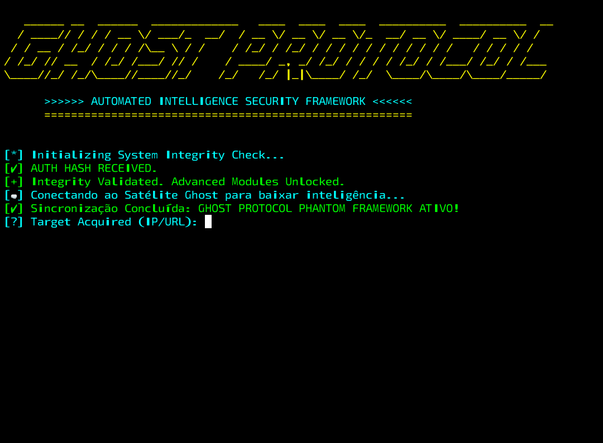
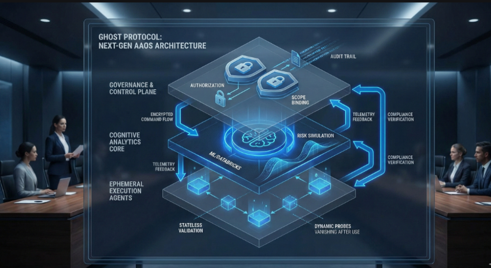
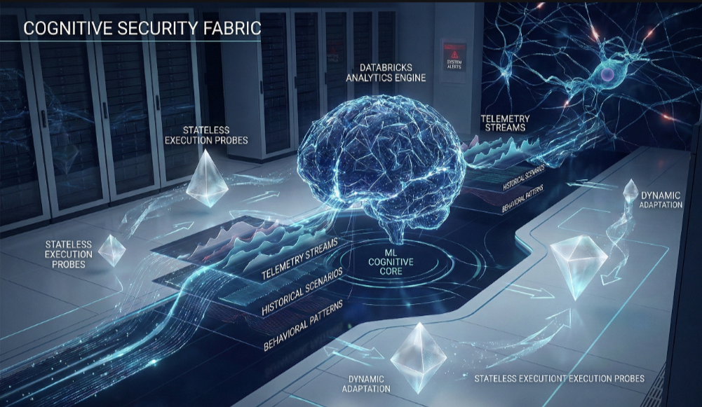
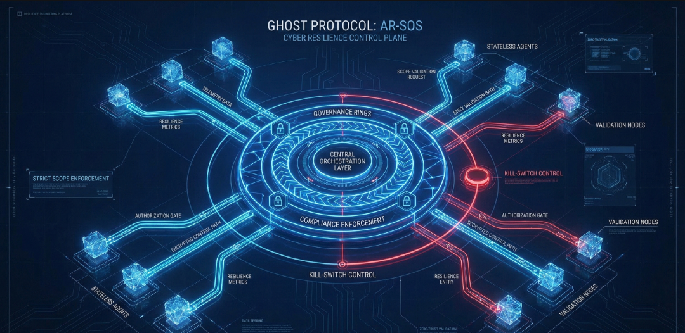

  
   

  
  
  

  <h1>GHOST PROTOCOL</h1>
  <h3>Plataforma de Validação de Resiliência Cibernética</h3>
  Simulação de Cenários Adversariais & Gestão de Exposição

---

> **Proposta de Valor:** O Ghost Protocol é uma plataforma de segurança cibernética orientada a risco, utilizada para **simular cenários reais de ameaça** contra infraestruturas corporativas. O sistema permite que organizações identifiquem fragilidades sistêmicas e validem seus controles defensivos antes que adversários reais o façam.

---

## 🎯 Por que o Ghost Protocol?

O mercado de segurança está saturado de ferramentas de *Compliance* que geram listas intermináveis de vulnerabilidades técnicas, mas falham em responder à pergunta crítica: **"Se formos atacados hoje, nossos controles aguentam?"**

O Ghost Protocol preenche a lacuna entre a conformidade teórica e a realidade operacional.

### Diferenciais Estratégicos
* **De Ferramenta para Plataforma:** Não entregamos apenas logs de erro; entregamos **Inteligência de Decisão**.
* **Validação Comportamental:** Diferente de scanners estáticos, o Ghost simula o **comportamento de um adversário sofisticado**, testando a capacidade de resposta do seu SOC e a resiliência da sua arquitetura.
* **Cenários Realistas:** Avaliação contínua sob condições de estresse operacional, modelando vetores que ferramentas automatizadas tradicionais ignoram.

---

## 🏗️ Metodologia e Arquitetura

Nossa abordagem utiliza uma arquitetura distribuída para modelar riscos complexos em ambientes heterogêneos. O sistema foi projetado para operar com baixo impacto na continuidade dos negócios, focando na precisão da análise.

  
   
  <em>Fig 1. Arquitetura Modular: Segregação entre coleta de telemetria, análise de risco e apresentação executiva.</em>

### 1. Camada de Avaliação (Input)
* **Função:** Coleta de evidências e telemetria de superfície.
* **Metodologia:** Utiliza técnicas passivas e ativas para mapear a exposição real da infraestrutura, simulando o reconhecimento feito por atores externos.

### 2. Camada Analítica (Processing)
* **Função:** Correlação de dados e Modelagem de Ameaça.
* **Metodologia:** Processa os dados coletados para distinguir "ruído técnico" de "risco de negócio", aplicando modelos estatísticos para prever caminhos de comprometimento.

### 3. Camada de Decisão (Presentation)
* **Função:** Interface de Apoio à Decisão Estratégica.
* **Metodologia:** Transforma dados técnicos em artefatos de decisão priorizados, permitindo que gestores foquem recursos onde o risco é iminente.

---

## 🧠 Inteligência de Risco

A plataforma abandona a visão linear de "listas de bugs" em favor de uma visão sistêmica.

  
   
  <em>Fig 2. Topologia de Risco: O sistema mapeia como pequenas falhas isoladas podem ser encadeadas para gerar impacto crítico.</em>

### Capacidades da Plataforma
1.  **Mapeamento de Superfície:** Visibilidade total de ativos expostos e sombra digital (Shadow IT).
2.  **Validação de Controles:** Teste prático da eficácia de Firewalls, WAFs e políticas de detecção.
3.  **Priorização Baseada em Impacto:** Classificação de risco baseada na probabilidade real de exploração no contexto do cliente.

---

## ⚖️ Modelo de Entrega e Operação

**O Ghost Protocol não é um software de prateleira (Off-the-Shelf).**
Trata-se de uma **Plataforma Gerenciada**, operada por especialistas em segurança ofensiva e defesa cibernética.

  
   
  <em>Fig 3. Visão do Operador: Interface desenhada para maximizar a interpretação humana sobre dados complexos.</em>

### Para quem é esta solução?
A plataforma é destinada exclusivamente a organizações que necessitam de validação de segurança de alto nível:

* 🏢 **Infraestruturas Críticas:** Energia, Telecom e Logística.
* 🏦 **Setor Financeiro e Fintechs:** Ambientes altamente regulados.
* 🛡️ **Centros de Operações de Segurança (SOCs):** Para validação contínua de detecção (Purple Teaming).

---

## 📌 Status e Contratação

Este repositório serve como documentação técnica da metodologia aplicada pela **Ghost Protocol Research Division**.

* **Modelo:** Enterprise Service / Managed Platform.
* **Disponibilidade:** Sob consulta para ambientes corporativos qualificados.
* **Licença:** Proprietária. O uso da tecnologia é restrito à prestação de serviços autorizada.

---

  <h3>"Segurança não é sobre a ausência de vulnerabilidades, mas sobre a capacidade de gerenciar o risco em tempo real."</h3>
  © 2026 Ghost Protocol Research Division.

